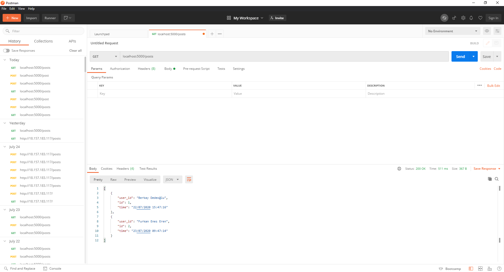

# `Flask-APW`
In the APW (R&D) department where I was in this project, I took part in writing the API part of a mobile 
application that will be used for people who come to the field. API implemented with Python 
programming language and Flask. It was mainly used for logging and transmitting the entered 
information to the computer.
## Tech and Libraries

- Flask
- Postman
- SQLAlchemy
- Marshmallow


## API Reference

#### Get all items

```http
  GET /posts
```

| Parameter | Type     | Description                |
| :-------- | :------- | :------------------------- |
|  | `json` | Get api post datas. |

```http
  POST /posts
```

| Parameter | Type     | Description                |
| :-------- | :------- | :------------------------- |
|  | `json` | Get user's tablet datas and write their personal computers and keep logs. |

#### Get item

```http
  GET /posts/${id}
```

| Parameter | Type     | Description                       |
| :-------- | :------- | :-------------------------------- |
| `id`      | `json` | Get a person with id from api. |

```http
  PATCH /posts/${id}
```

| Parameter | Type     | Description                       |
| :-------- | :------- | :-------------------------------- |
| `id`      | `json` | If person already exist, update process time in logs. |

```http
  DELETE /posts/${id}
```

| Parameter | Type     | Description                       |
| :-------- | :------- | :-------------------------------- |
| `id`      | `json` | Delete a person's logs from db log. |


## Screenshots

|  |
| :--:|
| *Postman for Testing* |

